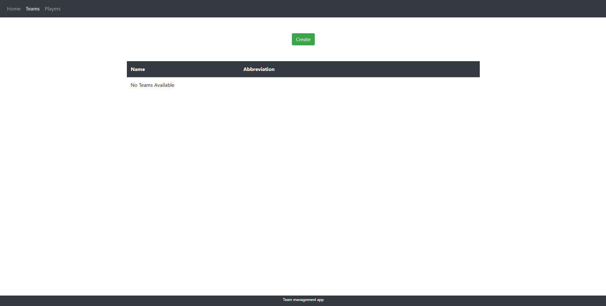
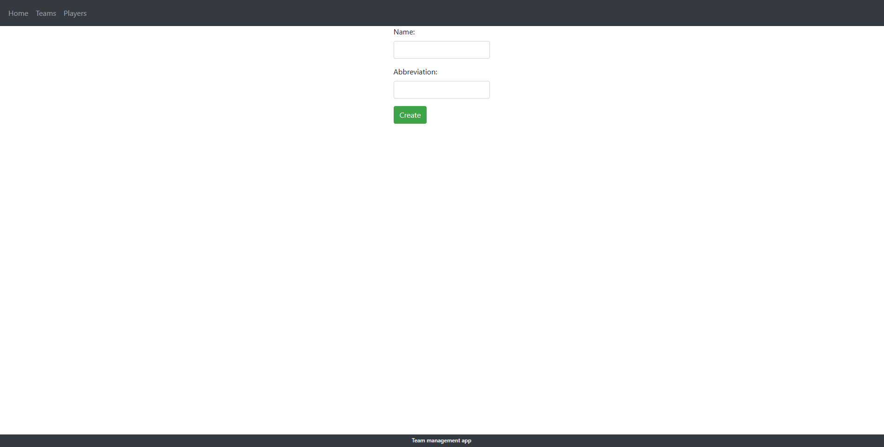
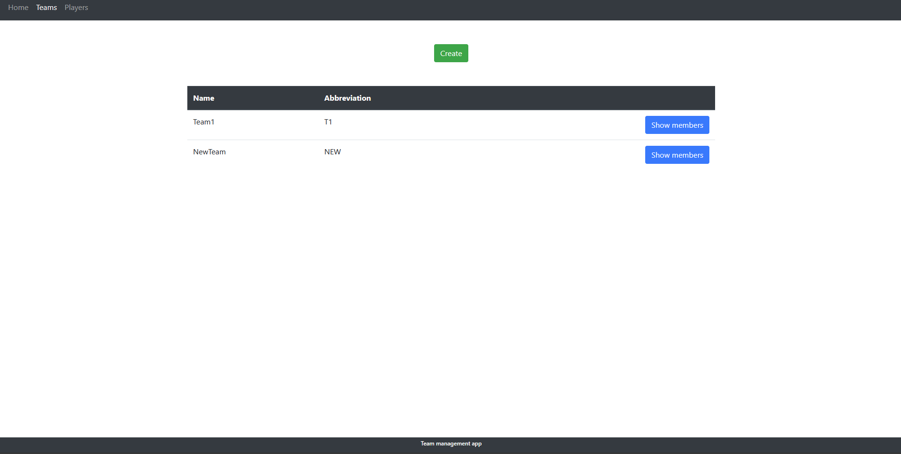
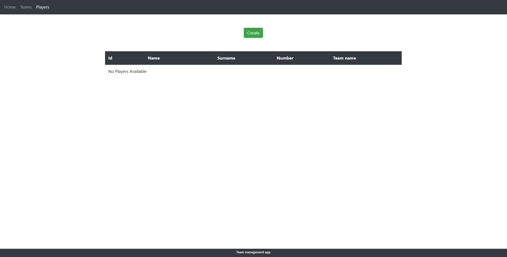
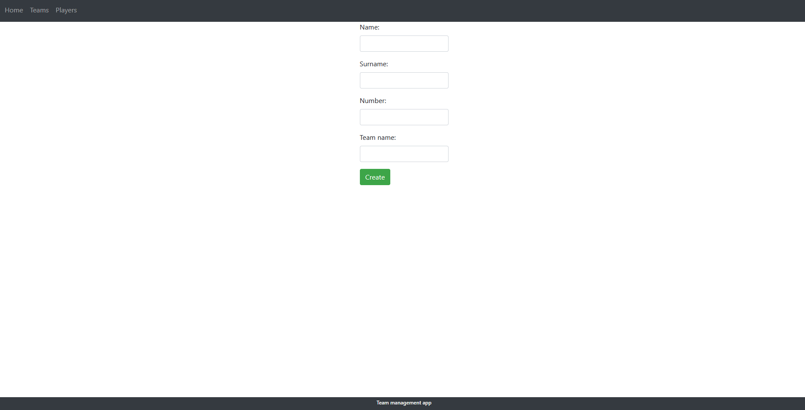
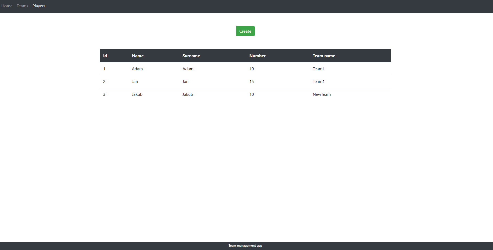
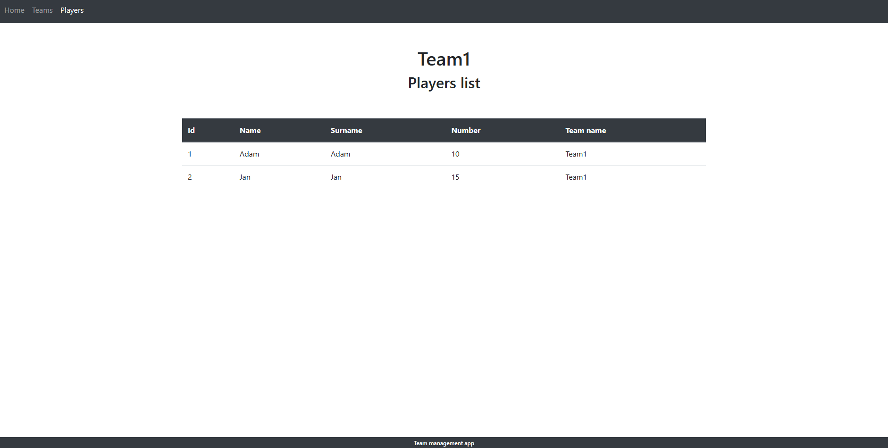
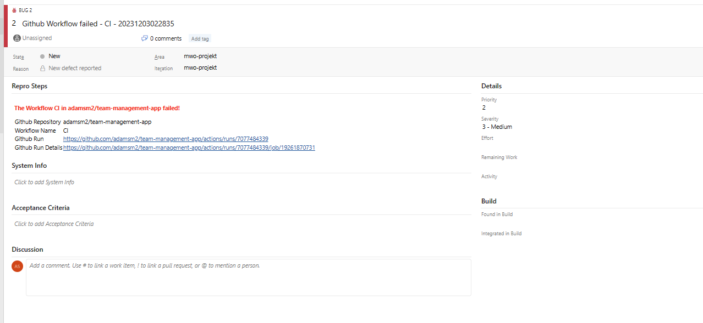

# Metodyki wytwarzania oprogramowania - projekt

## Aplikacja
Aplikacja została napisana w języku Java w wersji 17 przy użyciu frameworka Spring Boot. W warstwie widoku wykorzystano bibliotekę Thymeleaf. W celu przechowywania danych aplikacja używa bazy danych H2. Proces budowy i zarządzania zależnościami zostały zautomatyzowane przy użyciu narzędzia Maven, poniżej przedstawiam dodane zależności:

```xml
    <dependencies>
        <dependency>
            <groupId>org.springframework.boot</groupId>
            <artifactId>spring-boot-starter-data-jpa</artifactId>
        </dependency>
        <dependency>
            <groupId>org.springframework.boot</groupId>
            <artifactId>spring-boot-starter-thymeleaf</artifactId>
        </dependency>
        <dependency>
            <groupId>org.springframework.boot</groupId>
            <artifactId>spring-boot-starter-validation</artifactId>
        </dependency>
        <dependency>
            <groupId>org.springframework.boot</groupId>
            <artifactId>spring-boot-starter-web</artifactId>
        </dependency>
        <dependency>
            <groupId>org.springframework.boot</groupId>
            <artifactId>spring-boot-devtools</artifactId>
            <scope>runtime</scope>
            <optional>true</optional>
        </dependency>
        <dependency>
            <groupId>org.springframework.boot</groupId>
            <artifactId>spring-boot-configuration-processor</artifactId>
            <optional>true</optional>
        </dependency>
        <dependency>
            <groupId>org.postgresql</groupId>
            <artifactId>postgresql</artifactId>
            <scope>runtime</scope>
        </dependency>
        <dependency>
            <groupId>org.projectlombok</groupId>
            <artifactId>lombok</artifactId>
            <optional>true</optional>
        </dependency>
        <dependency>
            <groupId>org.springframework.boot</groupId>
            <artifactId>spring-boot-starter-test</artifactId>
            <scope>test</scope>
        </dependency>
        <dependency>
            <groupId>org.springframework.boot</groupId>
            <artifactId>spring-boot-testcontainers</artifactId>
            <scope>test</scope>
        </dependency>
        <dependency>
            <groupId>org.testcontainers</groupId>
            <artifactId>junit-jupiter</artifactId>
            <scope>test</scope>
        </dependency>
        <dependency>
            <groupId>org.seleniumhq.selenium</groupId>
            <artifactId>selenium-java</artifactId>
            <version>4.15.0</version>
            <scope>test</scope>
        </dependency>
        <dependency>
            <groupId>io.github.bonigarcia</groupId>
            <artifactId>webdrivermanager</artifactId>
            <version>5.6.2</version>
        </dependency>
        <dependency>
            <groupId>org.testcontainers</groupId>
            <artifactId>postgresql</artifactId>
            <scope>test</scope>
        </dependency>
        <dependency>
            <groupId>com.h2database</groupId>
            <artifactId>h2</artifactId>
            <scope>runtime</scope>
        </dependency>
    </dependencies>
```

Do zautomatyzowania testów UI została wykorzystana biblioteka Selenium, poniżej przedstawiam konfigurację oraz przykładowy test:

```java
@SpringBootTest(webEnvironment = SpringBootTest.WebEnvironment.DEFINED_PORT)
@ActiveProfiles("test")
class TeamTest {

    private static final String TEAMS_ENDPOINT_ADDRESS = "http://localhost:8080/teams";
    private WebDriver webDriver;

    @BeforeEach
    void setUp() {
        ChromeOptions options = new ChromeOptions();
        options.addArguments("--no-sandbox");
        options.addArguments("--disable-dev-shm-usage");
        options.addArguments("--headless");
        webDriver = new ChromeDriver(options);
        webDriver.manage().window().maximize();
        webDriver.get(TEAMS_ENDPOINT_ADDRESS);
    }

    @AfterEach
    void tearDown() {
        webDriver.quit();
    }

    @Test
    @DirtiesContext
    void givenTeamData_whenCreateTeam_thenTeamIsCreated() throws Exception {
        String teamName = "team1";
        String abbreviation = "t1";
        Thread.sleep(1000);
        webDriver.findElement(By.xpath("//*[contains(text(),'Create')]")).click();
        webDriver.findElement(By.id("name")).sendKeys(teamName);
        webDriver.findElement(By.id("abbreviation")).sendKeys(abbreviation);
        Thread.sleep(500);
        ((JavascriptExecutor) webDriver).executeScript("document.querySelector('button[type=\"submit\"]').click();");
        Thread.sleep(500);
        WebElement teamNameElement = webDriver.findElement(By.xpath("//*[contains(text(),'" + teamName + "')]"));
        assertThat(teamNameElement.isDisplayed()).isTrue();
    }
```
### Prezentacja graficzna








## Github Actions oraz integracja z Azure DevOps
Konfiguracja pipeline'a wykonująca testy UI dla każdego pull requesta / pusha do gałęzi main oraz w przypadku wystąpienia błędów w trakcie testów realizująca zgłoszenie buga w Azure DevOps.

```yaml
name: CI
on:
  pull_request:
    branches:
      - main
  push:
    branches:
      - main
  workflow_dispatch:

jobs:
  build:
    runs-on: ubuntu-latest

    steps:
      - uses: actions/checkout@v4

      - name: Set up Java version
        uses: actions/setup-java@v1
        with:
          java-version: '17'

      - name: Build and test with Maven
        run: mvn clean test

      - name: GitHub Action to create an Azure DevOps Bug Workitem when a workflow fails
        uses: stefanstranger/azuredevops-bug-action@1.1
        if: failure()
        with:
          OrganizationName: "mwo5"
          PAT: "PAT"
          ProjectName: "mwo-projekt"
          AreaPath: "mwo-projekt"
          IterationPath: "mwo-projekt"
          GithubToken: "GithubToken"
          WorkflowFileName: "main.yml"
        env:
          PAT: ${{ secrets.PAT}}
          GithubToken: ${{ secrets.githubtoken}}
```


Do integracji z Azure DevOps wykorzystano workflow GitHub Action to create an Azure DevOps Bug Workitem when a workflow fails.
https://github.com/marketplace/actions/github-action-to-create-an-azure-devops-bug-workitem-when-a-workflow-fails


Przykładowy zgłoszony bug:


## Prezentacja wideo pokazująca funkcjonowanie skonfigurowanego systemu


https://github.com/adamsm2/team-management-app/assets/95346590/b2c622b0-60da-4441-9612-52f8e20445cb


